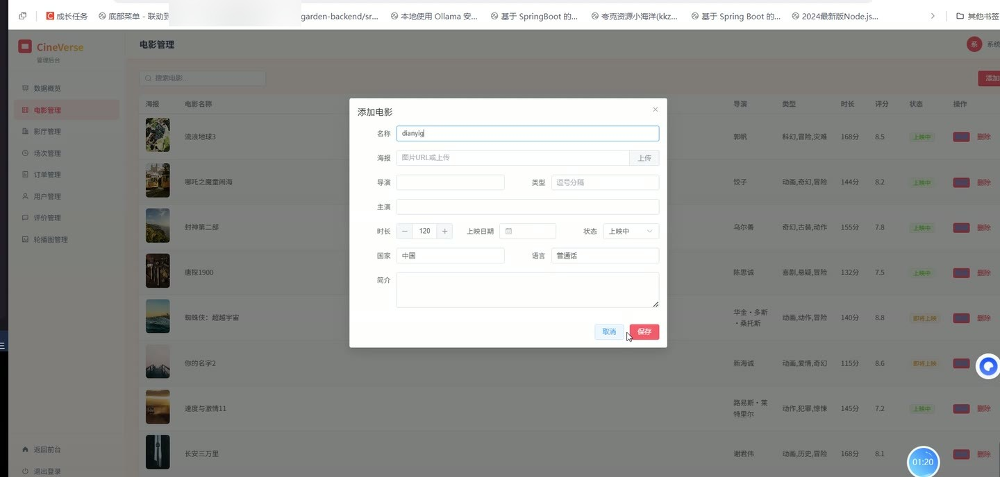
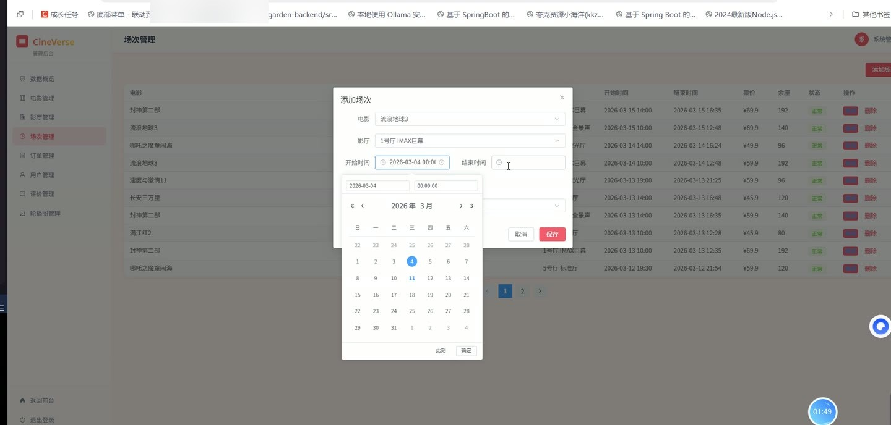
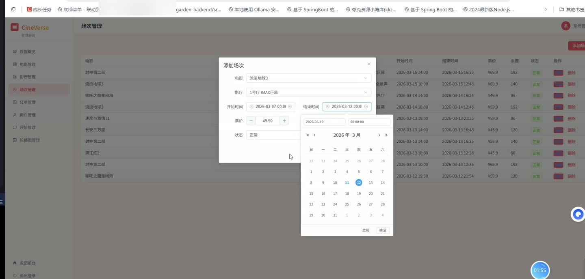

# (附文档)Springboot3+Vue3+MySQL 电影购票与评价系统

**技术栈**：Springboot3、Vue3、MySQL

### 系统简介

本系统是一个基于 Spring Boot 3 + Vue 3 + MySQL 的在线电影购票与评价平台，采用前后端分离架构。系统包含普通用户端和管理员端两个角色，用户可浏览电影、选座购票、发表评价，管理员可管理电影、影厅、场次、订单、评价及轮播图等核心业务。
 
### 核心功能
 
### 普通用户端

 
- 用户注册：填写用户名（至少3位）、密码（至少6位）、昵称，注册后自动登录为普通用户角色。 
- 用户登录：通过用户名和密码登录，支持 JWT 鉴权，登录后返回 token 和用户信息。 
- 首页轮播图：展示状态为启用的轮播图列表，按排序字段升序排列，可点击跳转关联电影。 
- 浏览电影列表：按分页展示电影，支持按关键字（标题/演员/导演）、类型、状态筛选，按评分降序排列。 
- 电影详情页：查看电影基本信息、场次列表（仅显示未开始且状态正常的场次）、用户评价列表。 
- 热门电影：展示评分最高的 10 部上映中电影。 
- 即将上映：展示即将上映的电影，按上映日期升序排列。 
- 电影推荐：未登录用户返回高评分电影；已登录用户根据购票历史中的电影类型推荐同类型未看过的电影，不足时补充高分电影。 
- 选座购票：选择场次后查看座位布局，选择座位（支持多选），提交订单前锁定座位 15 分钟，锁定期间其他用户不可选。 
- 座位状态查看：查看指定场次的所有座位锁定状态（已锁定、已售出），区分当前用户和其他用户。 
- 创建订单：提交所选座位后生成订单，订单包含唯一订单号、电影、场次、座位 JSON、总价，初始状态为待支付。 
- 支付订单：对待支付订单执行支付操作，支付后座位状态更新为已售出。 
- 取消订单：取消待支付订单，释放座位锁定并恢复场次可用座位数。 
- 退款：对已支付但未开场的订单申请退款，释放座位并恢复可用座位数。 
- 完成订单：将已支付订单标记为已完成。 
- 我的订单：查看当前用户的所有订单列表，包含电影标题、海报、影厅名称、场次时间、座位信息、总价、状态。 
- 发表评价：对已购电影发表评分（1-5分）和文字评价，每个用户对同一电影只能评价一次，评价后自动更新电影平均评分和评分人数。 
- 个人资料修改：修改昵称、手机号、邮箱、头像。 
- 修改密码：输入原密码和新密码（至少6位），验证原密码正确后更新。 
- 文件上传：上传图片文件，返回可访问的 URL 路径。
 
### 管理员端

 
- 仪表盘概览：展示注册用户总数、电影总数、总订单数、总收入（已支付/已完成订单），近7日订单趋势图，热门电影 TOP5（按评分降序）。 
- 用户管理：分页查看用户列表，支持按用户名/昵称搜索；可启用/禁用用户账号；可重置用户密码为 123456。 
- 电影管理：分页查看电影列表，支持按标题搜索；可添加电影（填写标题、海报、导演、演员、类型、时长、上映日期、状态、国家、语言、简介）；可编辑、删除电影。 
- 影厅管理：查看所有影厅列表；可添加影厅（名称、类型（标准厅/IMAX/3D/VIP）、行数、列数，自动计算座位数）；可编辑、删除影厅。 
- 场次管理：分页查看场次列表，显示关联电影、影厅、时间、价格、剩余座位；可添加场次（选择电影、影厅、开始时间、价格，自动计算结束时间和可用座位数）；可编辑、删除场次。 
- 订单管理：分页查看所有订单列表，包含用户信息、电影、场次、座位、金额、状态；可修改订单状态。 
- 评价管理：分页查看所有用户评价，包含评价人、电影、评分、内容；可启用/禁用评价；可删除评价。 
- 轮播图管理：查看轮播图列表（图片预览、标题、关联电影ID、排序、状态）；可添加轮播图（标题、图片、关联电影ID、排序、状态）；可编辑、删除轮播图。 
- 定时任务：每分钟自动清理过期的座位锁定（锁定超过15分钟未支付），并恢复对应场次的可用座位数。
 
### 技术栈

  后端框架 Spring Boot 3   ORM MyBatis-Plus（含分页插件、自动填充、逻辑删除）   权限认证 JWT（自定义拦截器 + @RequestAttribute 角色校验）   前端框架 Vue 3（Composition API + script setup）   状态管理 Pinia（用户状态存储）   前端路由 Vue Router 4（历史模式，路由守卫鉴权）   UI 组件库 Element Plus   构建工具 Vite   数据库 MySQL（含初始化 schema 和 data SQL 脚本）   工具库 Hutool（MD5 加密、雪花ID）、Jackson（JSON 处理） 
 
### 交付内容

 
- 后端完整源码 
- 前端完整源码 
- 数据库初始化脚本 
- 万字文档

## 界面展示

---

## 获取完整源码 + 万字文档

本仓库为项目介绍页。**完整前后端源码、数据库初始化脚本、万字项目文档**，请加微信 `kangkangcode`，或访问 [codekk.top](http://codekk.top) 获取。

可作课程设计 / 毕业设计参考，支持远程部署调试。